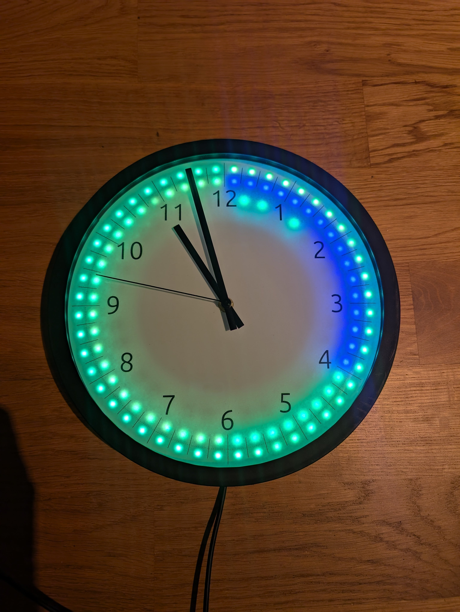
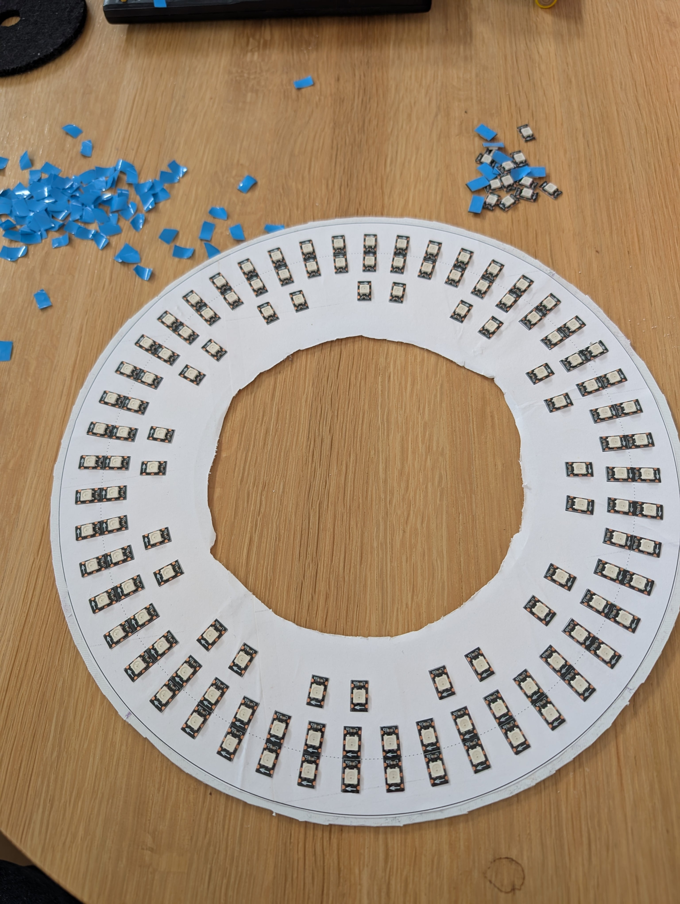
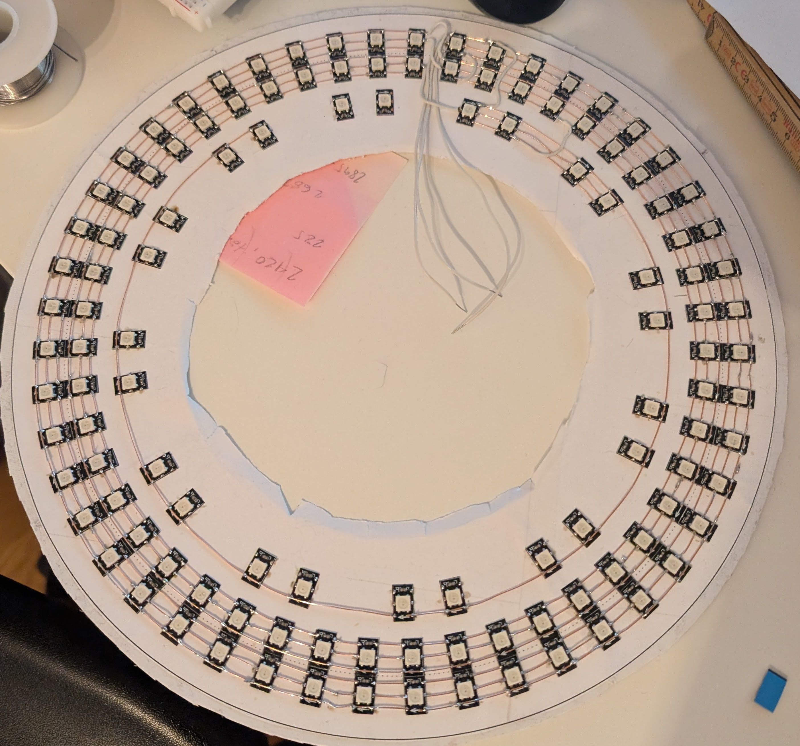
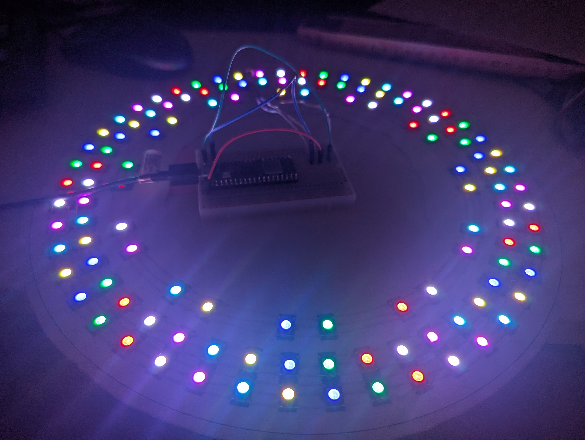
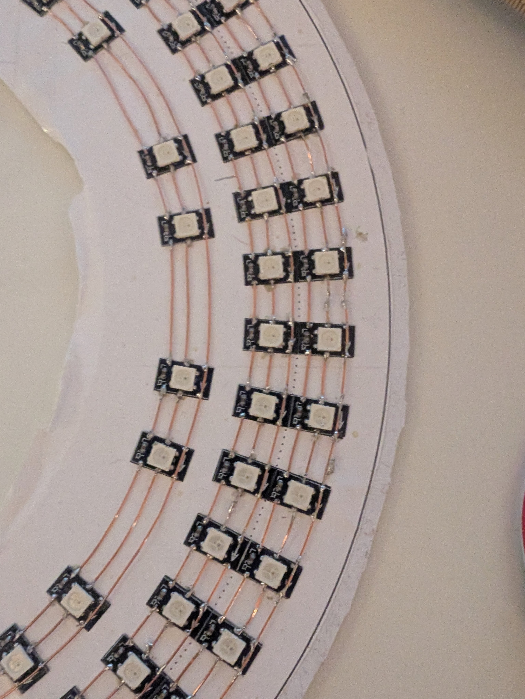

# Wall clock
Smart wall clock that displays the electricity price

## Bill of material:
* Amazon Basics wall clock
* NeoPixel led strip 144 pixels per meter. Each pixel where 12 mm high and 7 mm wide
* Raspberry pi Pico W
* USB power supply + cable
* Transparent plastic sheet 300 x 300 x 3 mm
* Some black PLA or your material of choice
* Copper wire
* Solder

For a total cost of around 500-600 SEK plus some shipping

## Steps:
* Read the instructions and the comments
* Print the 3d printed parts
  * The fit of the printed parts isn't perfect, but it was good enough to not warrant any changes.
    You will need to print 4 of each 3d part.
    I welded the backplate parts together with a soldering iron, and some more filament.
    The other parts I just added a bit of glue between them and a round of electrical tape around the piece.
 
* Cut the LED strip in pieces so that there is one led per piece
* Print the LED placement guide and glue it to the backplate
* Glue the LEDs to the placement guide
* Solder the wires to the LEDs (this will take a while)
  * I would suggest testing the work as you go, so that you don't have to redo the whole thing if something goes wrong.
  * Start at 12 o'clock and go clockwise around the clock, after the outer ring is done, go from the last led to the inner ring and repeat
* Solder the wires to the Pico W, I used GP0, VBUS and GND
* Cut the plastic sheet to size
* Print the clock face and drill a 8 mm hole in the middel through the face and the plastic sheet
* Assemble the clock
  * Fasten the clock face to the plastic sheet with a few small tape pieces on the edges
  * Add the clock mechanism to the plastic sheet and reattach the clock hands
  * Then add the parts in the correct order:
    * Glass
    * Glass holder
    * Clock face
    * Backplate with LEDs
    * Outer ring
* Glue the Pico W to the backplate so that it is still accessible but not sticking out too much so it hits the wall.
* Melt a hole in the side of the clock housing for the power cable
* Optional glue the cable to the backplate so it doesn't move around too much
* Upload the code to the Pico W
* Add the home assistant file as a [python script](https://www.home-assistant.io/integrations/python_script/) and adjust it to your needs and sensors.

# Images:

